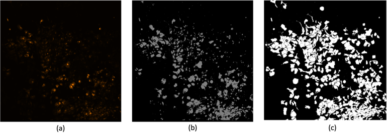
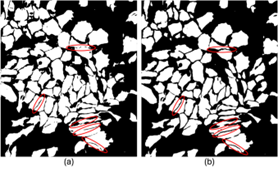

I was accepted to the 2247 - C STAR-Intern Researcher Scholarship Programme by TUBITAK, and this project was the result of this. This project focuses on processing and segmenting medical images, specifically single-channel fluorescent microscopy images. It includes tools for dataset preparation, patch division, mask application, and training/validation splitting for deep learning models.

Segmentation Example
<table align="center">
  <tr>
    <th>Model Comparison</th>
  </tr>
  <tr>
    <td></td>
  </tr>
  <tr>
    <td align="center">Segmentation of astrocyte cell regions. (a) raw image, (b) segmentation by baseline method, (c) segmentation by U-Net Inceptionv4.</td>
  </tr>
</table>

<table align="center">
  <tr>
    <td align="center">
      
    </td>
  </tr>
  <tr>
    <td align="center">
      Segmentation performance improvement on adjacent cells when inception layers are included in the encoder of U-net architecture. The significant improvements are shown with the yellow ellipses.
    </td>
  </tr>
</table>
